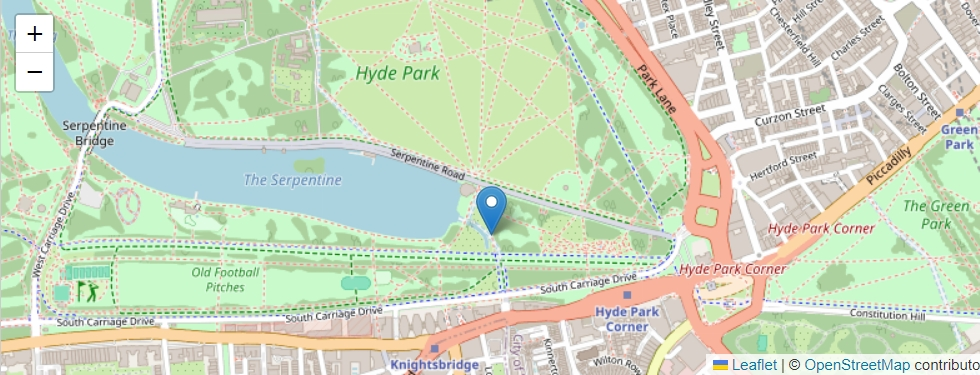
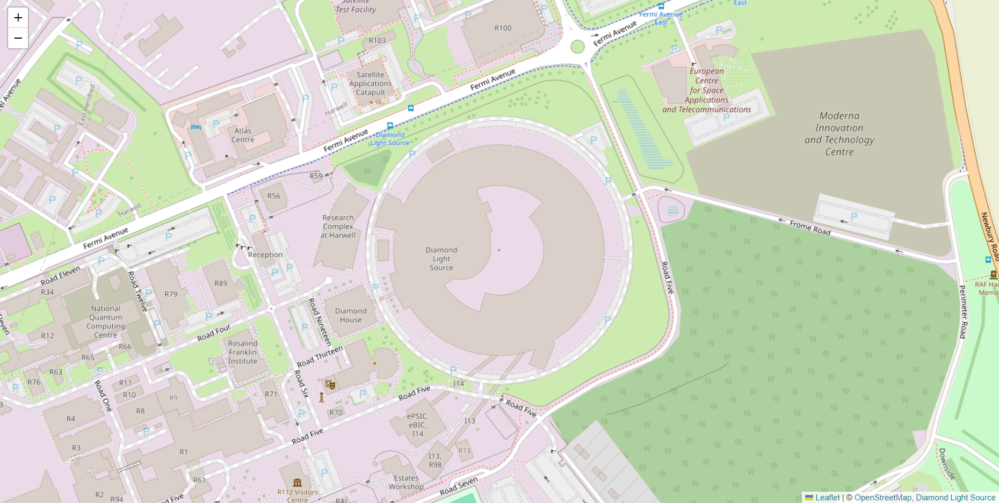
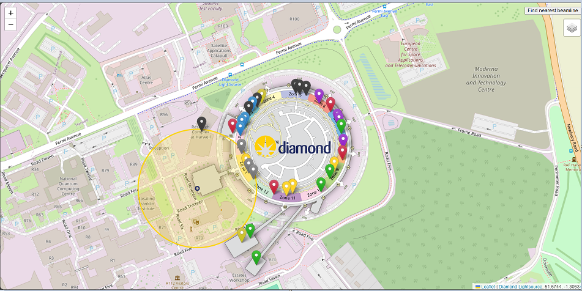

---

marp: true
paginate: true

---
# Building an interactive, informative web application
## *Thomas Evett & Vanshika Tummala*

---

# Development
## For our project we were tasked with making an interactive web program, this involved making a map of Diamond with markers and interactive features. We used Javascript, HTML and CSS to create the webpage.

---

# Coding the map
## To start with, we had to use Leaflet 'an open-source Javascript library for mobile-friendly interactive maps'. This helped us code the base of our website.


---

# Coding the map cont.
## Using leaflet, we adjusted a map to Diamond's geographical location.

```javascript
var map = L.map('map').setView([51.574349, -1.310892], 17);
        L.tileLayer('https://tile.openstreetmap.org/{z}/{x}/{y}.png', {
    maxZoom: 19,
    attribution: '&copy; <a href="http://www.openstreetmap.org/copyright">OpenStreetMap</a>'
}).addTo(map);
map.attributionControl.addAttribution('<a href="https://www.diamond.ac.uk">Diamond Light Source</a>');
```
---



---

# **Coding features**
## We learnt a lot of new syntax for coding with Javascript...

```javascript
var greenIcon = new L.Icon({
    iconUrl: 'diamond_light_source_image.png',
    iconSize: [204.4, 60],
    iconAnchor: [102.2, 30],
    popupAnchor: [1, -34],
    shadowSize: [41, 41]
  });
```
--- 

## HTML...

```html
<body>
    <div id="map">
        
    </div>
    <script src="diamond_map.js"></script>
</body>
```
--- 

## and CSS

```css
body {
    padding: 0;
    margin: 0;
}
html, body, #map {
    height: 100%;
    width: 100vw;
}
```
--- 

# **Features**
- ## Image of Diamond Lightsource's zones
- ## Markers for Beamlines
- ## Different coloured groups of beamlines
- ## Toggle for beamline groups
- ## User's location
- ## Button to find nearest beamline 
- ## Hover over map for coordinates

---

# **Testing**
## To test the website, we walked around the synchrotron to see if our location was accurately tracked and if the website showed the correct nearest beamline.

## We found that the user's location was not 100% accurate, so we added a circle around the user's marker to show the possible area that they could be in. This is a helpful feature.

---

# **FUN FACT**
# *WE ACTUALLY CODED THIS PRESENTATION WITH MARKDOWN, HTML AND CSS!*

---

# **Final Product**
[<ins>See the map here<ins>](https://14tevett.github.io/diamond-map/) 




